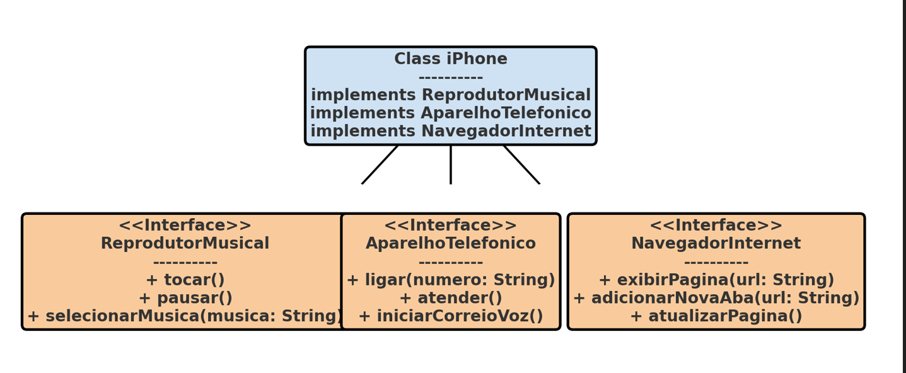

# Projeto iPhone Funcionalidades - Formação JAVA DIO

Este é um dos projeto que faz parte da Formação JAVA oferecida pela plataforma Digital Innovation One (DIO). Ele consiste na implementação de um modelo simplificado de algumas funcionalidades de um iPhone, utilizando a linguagem de programação Java e inclui um diagrama UML para representar a estrutura do projeto.

## Visão Geral

O projeto abrange a criação de interfaces e uma classe para simular funcionalidades básicas de um iPhone:
- Reprodutor Musical
- Aparelho Telefônico
- Navegador na Internet

Cada funcionalidade é representada por uma interface, e a classe `iPhone` implementa todas essas interfaces, demonstrando o princípio da Programação Orientada a Objetos (POO).

## Diagrama UML

O projeto inclui um diagrama UML para ilustrar a relação entre as classes e interfaces. Veja o diagrama abaixo para entender a estrutura do projeto:

## Estrutura do Projeto

O projeto é dividido nos seguintes arquivos:

- `ReprodutorMusical.java`: Interface que define métodos para um reprodutor musical.
- `AparelhoTelefonico.java`: Interface que define métodos para um aparelho telefônico.
- `NavegadorInternet.java`: Interface que define métodos para um navegador de internet.
- `iPhone.java`: Classe principal que implementa as três interfaces acima.

## Como Executar

Para executar este projeto, você precisa ter o Java instalado em seu ambiente. Siga os passos abaixo:

1. Clone o repositório para sua máquina local.
2. Navegue até o diretório do projeto.
3. Compile o projeto com o comando `javac iPhone.java`.
4. Execute o programa com `java iPhone`.

## Contribuições

Contribuições para o projeto são bem-vindas. Sinta-se à vontade para clonar, enviar PRs ou abrir issues para discussões e sugestões, principalmente se você faz parte dessa comunidade vibrante.

## Sobre a Digital Innovation One

A Digital Innovation One é uma plataforma de educação em tecnologia, que oferece cursos, bootcamps e formações em diversas áreas da TI. Este projeto faz parte do curso de Formação JAVA, onde os alunos aprendem conceitos e práticas essenciais da linguagem Java.

Site Oficial: [Digital Innovation One](https://dio.me)

